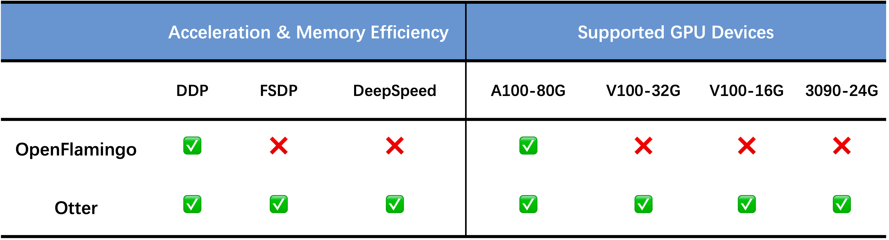

<p align="center" width="100%">

</p>


<div>
<div align="center">
    <a href='https://brianboli.com/' target='_blank'>Bo Li*</a>&emsp;
    <a href='https://zhangyuanhan-ai.github.io/' target='_blank'>Yuanhan Zhang*</a>&emsp;
    <a href='https://king159.github.io/' target='_blank'>Jinghao Wang*</a>&emsp;
    <a href='https://cliangyu.com/' target='_blank'>Liangyu Chen*</a>&emsp;
    </br>
    <a href='https://jingkang50.github.io/' target='_blank'>Jingkang Yang</a>&emsp;
    <a href='https://liuziwei7.github.io/' target='_blank'>Ziwei Liu</a>
</div>
<div>
<div align="center">
    S-Lab, Nanyang Technological University
</div>
 
 -----------------


[Otter Demo](https://otter.cliangyu.com/) | [Otter-9B (Huggingface Models)](https://huggingface.co/luodian/otter-9b-hf) | [Paper]() | [Video](https://otter.cliangyu.com/)


## 🦦 Overview

Recent research emphasizes the importance of instruction tuning in empowering Large Language Models (LLMs), such as boosting GPT-3 to Chat-GPT, to adhere to natural language instruction and effectively accomplish real-world tasks. Flamingo is considered a GPT-3 moment in the multimodal domain. In our project, we propose 🦦 Otter, an in-context instruction-tuned model built upon Flamingo. We enhance its chat abilities by utilizing a carefully constructed multimodal instruction tuning dataset. Each data sample includes an image-specific instruction along with multiple multimodal instructions, also referred to as multimodal in-context learning examples.

## 🗂️ Environments

You may install via `conda env create -f environment.yml`. Especially to make sure the `transformers>=4.28.0`, `accelerate>=0.18.0`.

## 🤗 Hugging Face Model

Previous OpenFlamingo was developed with DDP and it's not easy to implement a fully sharded mechanism. Loading OpenFlamingo-9B to GPU memory requires >33G GPU memory.

To accelerate and demoncratize it, we wrap the Open Flamingo model into a 🤗 huggingface model. We use `accelerator` to speed up our training and implement in a fully sharded mechanism across multiple GPUs. 

This can help researchers who do not have access to A100-80G GPUs to achieve the same throughput in training, testing on 4x3090-24G GPUs and model deployment on 2x3090-24G GPUs. Specific details are in below.

<div style="text-align:center">

</div>

<div style="text-align:center">

</div>

Our Otter model is also developed in this way and it's deployed on the 🤗 Hugging Face model hub.

You can use the 🦩 Flamingo model / 🦦 Otter model as a huggingface model with only few lines! One click and then model configs/weights are downloaded automatically.

``` python
from flamingo import FlamingoModel
flamingo_model = FlamingoModel.from_pretrained("luodian/openflamingo-9b-hf")

from otter import OtterModel
otter_model = OtterModel.from_pretrained("luodian/otter-9b-hf")
```

## 🗄 Dataset Preparation

Download a subset of the pretraining `multi_instruct_data` dataset

```bash
wget https://ofa-beijing.oss-cn-beijing.aliyuncs.com/datasets/pretrain_data/pretrain_data_examples.zip;
unzip pretrain_data_examples.zip ./example_multi_instruct_data
```

## ☄️ Training

Train on `multi_instruct` datasets, use following commands:

First run, and answer the questions asked. This will generate a config file and save to cache folder. The config will be used automatically to properly set the default options when doing `accelerate launch`.

```bash
accelerate config
```

Then run the training script.

```bash
accelerate launch
```

## 💎 Checkpoints

## 🪩 Web Demo
We host our demo on [Otter Demo](https://otter.cliangyu.com/). Launch your own demo by following [instructions](docs/demo.md).

### 🛠 Incoming Support

### Features

We are working on the following features. We are working hard to provide these features. Here are some of the issues we have encountered. If you know the answers, please feel free to submit a pull request with your code. We will be very grateful.

- [ ]  `xformers` support: for saving GPU memory and training speedup. [[issue]()]
- [ ]  `load_in_8bit` support: for saving GPU memory and training speedup. [[issue]()]

### Models

We are working on the following models with much stronger performance.

- [ ] Otter-9B for Videos
- [ ] Otter-15B

### 👨‍🏫 Acknowledgements 

We thank [Chunyuan Li](https://chunyuan.li/) and [Jack Hessel](https://jmhessel.com/) for their advising and supporting, as well as the Open Flamingo team for their great contribution to the open source community.