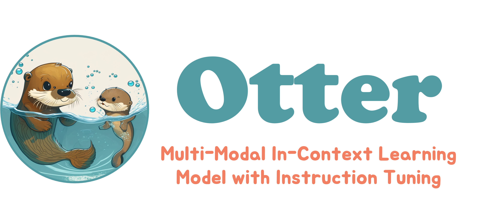

<!-- # 🦦 Otter: Multi-Modal In-Context Learning Model with Instruction Tuning -->

<p align="center" width="100%">

</p>
 
<!-- ## Explore 🦦 Otter, Give it instruction, and see its in-context learning ability! -->

<!-- [Otter Demo](https://otter.cliangyu.com/) -->


## 🦦 Overview

Recent research emphasizes the importance of instruction tuning in empowering Large Language Models (LLMs), such as boosting GPT-3 to Chat-GPT, to adhere to natural language instruction and effectively accomplish real-world tasks. Flamingo is considered a GPT-3 moment in the multimodal domain. In our project, we propose 🦦 Otter, an in-context instruction-tunning model built upon Flamingo. We enhance its abilities by utilizing a carefully constructed multimodal instruction tuning dataset. Each data sample includes an image-specific instruction along with multiple multimodal instructions, also referred to as multimodal in-context learning examples.

## 🗂️ Environment

You may install via `conda env create -f environment.yml`  or manually install the following packages. Especially to make sure the `transformers>=4.28.0`, `accelerate==0.19.0.dev0`.

## 🤗 Hugging Face Model

Previous OpenFlamingo was developed with DDP and it's not easy to implement a fully sharded mechanism. Loading Openflaming-9B to GPU memory requires >33G GPU memory.

To accelerate and demoncratize it, we wrap the Open Flamingo model into a huggingface model. We use `accelerator` to speed up our training and implement in a fully sharded mechanism across multiple GPUs. 

This can help researchers who do not have access to A100-80G GPUs to achieve the same throughput in training, testing on 4x3090-24G GPUs and model deployment on 2x3090-24G GPUs. Specific details are in below.

<div style="text-align:center">

</div>

<div style="text-align:center">

</div>

Our Otter model is also developed in this way and it's deployed on the 🤗 Hugging Face model hub.

You can use the 🦩 Flamingo model / 🦦 Otter model as a huggingface model with only few lines! One click and then model configs/weights are downloaded automatically.

``` python
from flamingo import FlamingoModel
flamingo_model = FlamingoModel.from_pretrained("luodian/openflamingo-9b-hf")

from otter import OtterModel
otter_model = OtterModel.from_pretrained("luodian/otter-9b-hf")
```

## Dataset Preparation

Download a subset of the pretraining `multi_instruct_data` dataset

```bash
wget https://ofa-beijing.oss-cn-beijing.aliyuncs.com/datasets/pretrain_data/pretrain_data_examples.zip;
unzip pretrain_data_examples.zip ./example_multi_instruct_data
```

## ☄️ Training

Train on `multi_instruct` example datasets, use following commands:

## 🪩 Web Demo
We launch our demo on [Otter Demo](https://otter.cliangyu.com/). You can launch your own demo by following [instructions](docs/demo.md).

## 👨‍💻 Authors

Equal contribution, alphabetical order.

[Liangyu Chen](https://cliangyu.com/)

[Bo Li](https://brianboli.com/)

[Jinghao Wang](https://king159.github.io/)

[Yuanhan Zhang](https://zhangyuanhan-ai.github.io/)

### 👨‍🏫 Acknowledgements 

We thank Jingkang Yang and Ziwei Liu for advising and supporting, as well as the Open Flamingo team for their great contribution to the open source community.
