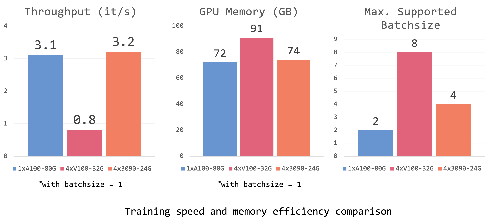

<p align="center" width="100%">

</p>


<div>
<div align="center">
    <a href='https://brianboli.com/' target='_blank'>Bo Li*</a>&emsp;
    <a href='https://zhangyuanhan-ai.github.io/' target='_blank'>Yuanhan Zhang*</a>&emsp;
    <a href='https://cliangyu.com/' target='_blank'>Liangyu Chen*</a>&emsp;
    <a href='https://king159.github.io/' target='_blank'>Jinghao Wang*</a>&emsp;
    </br>
    <a href='https://jingkang50.github.io/' target='_blank'>Jingkang Yang</a>&emsp;
    <a href='https://liuziwei7.github.io/' target='_blank'>Ziwei Liu</a>
</div>
<div>
<div align="center">
    S-Lab, Nanyang Technological University
</div>
 
 -----------------


[](https://otter.cliangyu.com)

 [Otter Demo](https://otter.cliangyu.com/) | [Otter-9B (Huggingface Models)](https://huggingface.co/luodian/otter-9b-hf) | [Paper]() | [Video](https://otter.cliangyu.com/)

## 🦦 Overview

<div style="text-align:center">

</div>

Recent research highlights the importance of fine-tuning instruction for empowering large language models (LLMs), such as enhancing GPT-3 to Chat-GPT, to follow natural language instructions and effectively accomplish real-world tasks. Flamingo is considered a GPT-3 moment in the multimodal domain. 

In our project, we propose 🦦 Otter, an instruction-tuned model built upon OpenFlamingo that has been customized for a context. We improve its conversational skills by using a carefully crafted multimodal instruction tuning dataset. Each data sample includes an image-specific instruction along with multiple examples of multimodal instructions for that context, also known as multimodal in-context learning examples.

By utilizing high-quality data, we were able to train 🦦 Otter using limited resources (4x RTX-3090-24G GPUs) in our lab. Remarkably, it surpassed the performance of OpenFlamingo. While Otter may not be the most advanced and may occasionally experience confusion, we are committed to consistently enhancing its capabilities through including more types of training data and a larger model. In the current era of expansive foundational models, we firmly believe that anyone should have the opportunity to train their own models, even with scarce data and resources, and cultivate the models to develop their intelligence.

## 🦦 Examples

## 🗂️ Environments

You may install via `conda env create -f environment.yml`. Especially to make sure the `transformers>=4.28.0`, `accelerate>=0.18.0`.

## 🤗 Hugging Face Model

You can use the 🦩 Flamingo model / 🦦 Otter model as a 🤗 huggingface model with only a few lines! One-click and then model configs/weights are downloaded automatically.

``` python
from flamingo import FlamingoModel
flamingo_model = FlamingoModel.from_pretrained("luodian/openflamingo-9b-hf", device_map=auto)

from otter import OtterModel
otter_model = OtterModel.from_pretrained("luodian/otter-9b-hf", device_map=auto)
```

Previous [OpenFlamingo](https://github.com/mlfoundations/open_flamingo) was developed with [DistributedDataParallel](https://pytorch.org/docs/stable/nn.html#torch.nn.parallel.DistributedDataParallel) (DDP). Loading OpenFlamingo-9B to GPU requires **at least 33G GPU memory**, which is only available on A100 GPUs.

In order to allow more researchers without access to A100 machines to try training OpenFlamingo, we wrap the OpenFlamingo model into a 🤗 huggingface model ([Jinghao](https://king159.github.io/) has submitted a [PR](https://github.com/huggingface/transformers/pull/23063) to the /huggingface/transformers!). We use `accelerator` to speed up our training and implement it in a fully sharded mechanism (via `device_map=auto`) across multiple GPUs.

This can help researchers who do not have access to A100-80G GPUs to achieve the similar throughput in training, testing on 4x RTX-3090-24G GPUs, and model deployment on 2x RTX-3090-24G GPUs. Specific details are below (may vary depending on the CPU and disk performance, as we conducted training on different machines).

<div style="text-align:center">

</div>

---
<div style="text-align:center">

</div>

Our Otter model is also developed in this way and it's deployed on the 🤗 Hugging Face model hub. Our model can be hosted on two RTX-3090-24G GPUs and achieve a similar speed to one A100-80G machine.


## 🗄 Dataset Preparation

### Multi-model instruction tuning dataset with in-context examples (ICI)

The pre-training process for the OpenFlamingo model employs the MMC4 interleaved multimodality dataset to endow the model with in-context few-shot learning capabilities. The development of our instruction-following dataset adheres to the guiding principles of MMC4, which dictate that the instruction and image examples incorporated into the context should exhibit semantic pertinence to the query instruction and image.

1. To augment the LLaVA dataset, we retrieve in-context examples for each query data.
2. We curate high-quality video data from the Video PSG repository (https://github.com/Jingkang50/OpenPSG). For each video, we select 4-8 frames to be annotated for instruction-following, using the LLaVa dataset as a reference. During the training phase, given a frame, we opt for additional frames, along with their corresponding instructions and answers, to serve as in-context examples.

### Example

<p align="center" width="100%"></a></p>

### Preparation

We unify different instructing data into a single dataset [class](pipeline/multi_instruct_data_utils/unify_dataset.py). Full dataset is coming soon! 

<!-- Download a subset of the pretraining `multi_instruct_data` dataset

```bash
wget https://ofa-beijing.oss-cn-beijing.aliyuncs.com/datasets/pretrain_data/pretrain_data_examples.zip;
unzip pretrain_data_examples.zip ./example_multi_instruct_data
``` -->

## ☄️ Training

Train on `in-context-instruction(ICI)` datasets, using the following commands:

First, run, and answer the questions asked. This will generate a config file and save it to the cache folder. The config will be used automatically to properly set the default options when doing `accelerate launch`.

```bash
accelerate config
```

Then run the training script.

```bash
accelerate launch --pretrained_model_name_or_path=luodian/openflamingo-9b-hf \
--lm_path=luodian/llama-7b-hf \
--tokenizer_path=luodian/llama-7b-hf \
--dataset_resampled \
--multi_instruct_path=./in_context_instruct.tsv \
--run_name=otter-9b \
--batch_size=1 \
--num_epochs=6 \
--report_to_wandb \
--cross_attn_every_n_layers=4 \
--lr_scheduler=cosine \
--delete_previous_checkpoint \
--learning_rate=1e-5 \
```

## 💎 Checkpoints

For details, you may refer to the [model card](docs/model_card.md).

## 🪩 Web Demo

We host our [Otter-9B Demo](https://otter.cliangyu.com/) via dual RTX-3090. Launch your own demo by following the [demo instructions](docs/demo.md).

## 🛠 Incoming Features

We are working towards offering these features to our users. However, we have encountered some issues in the process. If you have the solutions to these issues, we would be grateful if you could submit a pull request with your code. Your contribution would be highly appreciated.

- [ ]  `xformers` support: for saving GPU memory and training speedup. issue [#35](https://github.com/Luodian/PET-VLM/issues/35)
- [ ]  `load_in_8bit` support: for saving GPU memory and training speedup. [[issue]()]

### Models

We are working on the following models with much stronger performance.

- [ ] Otter-9B for Videos
- [ ] Otter-15B


## 📑 Citation

If you found this repository useful, please consider citing:
```
@software{li_bo_2023_7879884,
  author       = {Li, Bo and Zhang, Yuanhan and Chen, Liangyu and Wang, Jinghao and Yang, Jingkang and Liu, Ziwei},
  title        = {{Otter: Multi-Modal In-Context Learning Model with Instruction Tuning}},
  month        = apr,
  year         = 2023,
  publisher    = {Zenodo},
  version      = {0.1},
  doi          = {10.5281/zenodo.7879884},
  url          = {https://doi.org/10.5281/zenodo.7879884}
}
```

### 👨‍🏫 Acknowledgements

We thank [Chunyuan Li](https://chunyuan.li/) and [Jack Hessel](https://jmhessel.com/) for their advise and support, as well as the [OpenFlamingo](https://github.com/mlfoundations/open_flamingo) team for their great contribution to the open source community.
