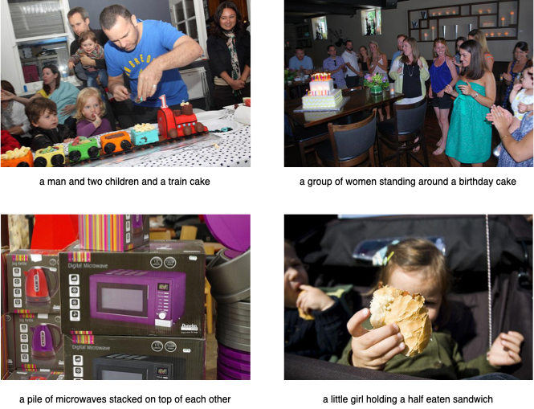
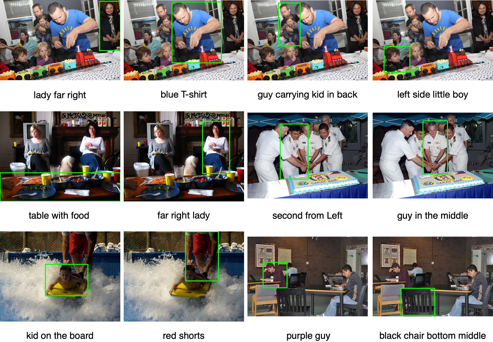
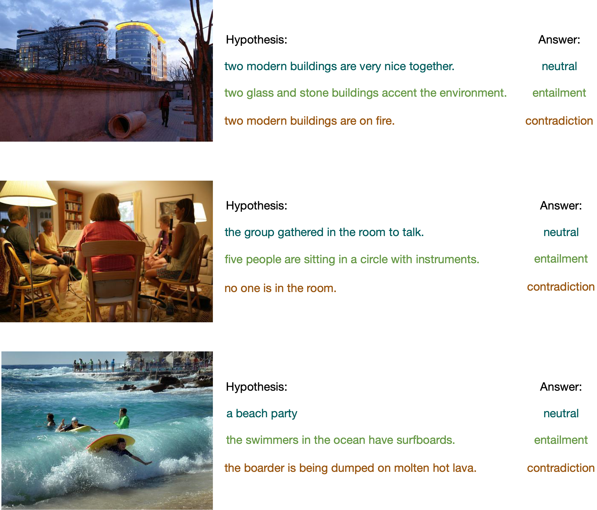

<!---
Copyright 2022 The OFA-Sys Team. 
All rights reserved.
This source code is licensed under the Apache 2.0 license found in the LICENSE file in the root directory.
-->

# OFA-Compress (HuggingFace version)
OFA-Compress is a unified framework for OFA compression. 
It provides OFA model finetuning, distillation and inference capabilities in Huggingface version, and is committed to promoting the lightweighting of large models.

## Project Architecture
- ofa: provides OFA model implemented on huggingface transformers.
- data_utils:  provides a `OFADataset` that subclasses `torch.utils.data.Dataset` to process data into samples and label, and implement classes specific to the particular tasks (e.g., caption_dataset.py, refcoco_dataset.py, snli_ve_dataset.py, etc). 
- scripts: provides evaluate, finetune and distill shell scripts specific to the particular task.
- train: provides functions to execute models. 
- textbrewer: a PyTorch-based knowledge distillation toolkit for natural language processing. Check https://github.com/airaria/TextBrewer
- generate: the sequence generator implemented on the Fairseq codebase. 


## Requirements
* python 3.6
* pytorch 1.8
* torchvision 0.9.1
* transformers 4.16.2
* datasets 1.17.0
* pillow 8.3.2


We welcome contributions to our project. Feel free to contact us or send us issues/PRs!
<br></br>

# Results
Below we demonstrate the results of OFAs on cross-modal tasks.
<table border="1" width="100%">
    <tr align="center">
        <th>Task</th><th>Image Captioning</th><th>Visual Entailment</th><th colspan="3">Referring Expression Comprehension</th>
    </tr>
    <tr align="center">
        <td>Dataset</td><td>COCO</td><td>SNLI-VE</td><td>RefCOCO</td><td>RefCOCO+</td><td>RefCOCOg</td>
    </tr>
    <tr align="center">
        <td>Split</td><td>Karpathy test (CE)</td><td>val/test</td><td>val/test-a/test-b</td><td>val/test-a/test-b</td><td>val-u/test-u</td>
    </tr>
    <tr align="center">
        <td>Metric</td><td>CIDEr</td><td>Acc.</td><td colspan="3">Acc.</td>
    </tr>
    <tr align="center">
        <td>OFA<sub>Tiny</sub></td><td>119.0</td><td>85.3 / 85.2</td><td>80.20 / 84.07 / 75.00</td><td>68.22 / 75.13 / 57.66</td><td>72.02 / 69.74</td>
    </tr>
    <tr align="center">
        <td>OFA-Compress<sub>Tiny</sub></td><td>120.0</td><td>87.0 / 86.9</td><td>81.29 / 85.18 / 75.29</td><td>71.28 /  77.08 / 61.13 </td><td>72.08  / 71.67  </td>
    </tr>
</table>

## Image Captioning


## Visual Grounding


## Visual Entailment



# Installation
```bash
git clone https://github.com/OFA-Sys/OFA-Compress
pip install -r requirements.txt
```
<br></br>

# Datasets and Checkpoints
See [datasets.md](datasets.md) and [checkpoints.md](checkpoints.md).
<br></br>

# Usage
Below we provide methods for finetuning, distillation and inference on different downstream tasks.
## Preparing the Dataset and checkpoints
To use OFA-Compress, you should first download the dataset and pretrained checkpoints in the OFA repository (see <a href='https://github.com/OFA-Sys/OFA/blob/main/checkpoints.md'>checkpoints.md</a> and <a href='https://github.com/OFA-Sys/OFA/blob/main/datasets.md'>datasets.md</a>). 
Since the checkpoints are trained in Fairseq framework, we provide a script  <code>convert_ofa_original_ckpt_to_huggingface.py</code> to convert the original ckpt to Huggingface version.
<pre>python convert_ofa_original_ckpt_to_huggingface.py  --pt_model /xxx/ofa-refcoco-large/refcoco_large_best.pt --hf_model_dir /xxx/ofa-refcoco-large/</pre>
## Finetuning
To finetune OFA, you should set the <code>${init_method}</code> to 'load_pretrain', and the framework will load the pretrained ckpt from <code>${load}</code> you set.
We provide the finetuning scripts as following:
<pre>cd scripts/finetune
bash caption_finetune.sh # Image caption task. For refcoco and snli-ve, use refcoco_finetune.sh and snlive_finetune.sh</pre>
## Distillation
To start task-specific distillation, you need to provide the finetuned teacher model and the un-trained or pretrained student model in <code>model_paths.py</code>.
Then, you should setup the configuration for distillation, such as knowledge distillation loss <code>${kd_loss_type}</code>, layer matches <code>${intermediate_matches}$</code>, etc.
We provide the distillation scripts as following:
<pre>cd scripts/distill
bash caption_distill.sh # Image caption task. For refcoco and snli-ve, use refcoco_distill.sh and snlive_distill.sh</pre>
### Quick Start
```python
from ofa.modeling_ofa import OFAModel
from criterions import AdjustLabelSmoothedCrossEntropyCriterion
from ofa_distill import OFADistiller
from ofa_distill import OFADistillationConfig
from textbrewer import TrainingConfig


output_dict = {
                "output_attentions": True,
                "output_hidden_states": True
            }
model_T = OFAModel.from_pretrained("ofa-caption-large-stage1", **output_dict)
model_S = OFAModel.from_pretrained("ofa-tiny", **output_dict)


def simple_adaptor(batch, model_outputs):
    outputs = {}
    criterion = AdjustLabelSmoothedCrossEntropyCriterion()
    loss, sample_size, logging_output = criterion(model_outputs, batch)
    outputs["losses"] = loss / logging_output['sample_size']
    outputs["sample_size"] = logging_output['sample_size']
    outputs["target"] = batch["target"]
    if "constraint_masks" in batch:
        outputs["constraint_masks"] = batch["constraint_masks"]

    for k1, k2 in zip(["encoder_attentions", "decoder_attentions",
                       "encoder_hidden_states", "decoder_hidden_states",
                       "encoder_last_hidden_state", "logits",
                       "cross_attentions"],
                      ["encoder_attention", "decoder_attention",
                       "encoder_hidden", "decoder_hidden",
                       "encoder_last", "logits",
                       "cross_attention"]):
        if k1 in model_outputs:
            outputs[k2] = model_outputs[k1]
    return outputs

# Training configuration
train_config = TrainingConfig()
# Distillation configuration
# Matching different layers of the student and the teacher
distill_config = OFADistillationConfig(
        text_preprocessor=args.tokenizer,
        temperature=args.temperature,
        temperature_scheduler=args.temperature_scheduler,
        hard_label_weight=args.hard_label_weight,
        hard_label_weight_scheduler=args.hard_label_weight_scheduler,
        kd_loss_type=args.kd_loss_type,
        kd_loss_weight=args.kd_loss_weight,
        kd_loss_weight_scheduler=args.kd_loss_weight_scheduler,
        probability_shift=args.probability_shift,
        intermediate_matches=args.intermediate_matches,
        is_caching_logits=args.is_caching_logits,
        constraint_range=args.constraint_range)
# Build distiller
distiller = OFADistiller(train_config, distill_config, model_T,
                         model_S, simple_adaptor, simple_adaptor)

# Start!
with distiller:
    distiller.train(optimizer,
                    scheduler_class=scheduler_class,
                    scheduler_args=scheduler_args,
                    max_grad_norm=1.0,
                    dataloader=train_loader,
                    num_epochs=10,
                    callback=None)
```
## Inference
To evaluate your models, you should first provide the model ckpt in the <code>${load}</code> configuration.
We provide the inference scripts as following:
<pre>cd scripts/evaluate
bash caption_evaluate.sh # Image caption task. For refcoco and snli-ve, use refcoco_evaluate.sh and snlive_evaluate.sh</pre>

# Related Codebase
* [Fairseq](https://github.com/pytorch/fairseq)
* [taming-transformers](https://github.com/CompVis/taming-transformers)
<br></br>


# Getting Involved
Feel free to submit Github issues or pull requests. Welcome to contribute to our project!

To contact us, never hestitate to send an email to `fay.cyf@alibaba-inc.com` or `zhangjianwei.zjw@alibaba-inc.com`!
<br></br>


# Citation
Please cite our paper if you find it helpful :)

```
@article{Lu2022KnowledgeDO,
  author    = {Chengqiang Lu and 
               Jianwei Zhang and 
               Yunfei Chu and 
               Zhengyu Chen and 
               Jingren Zhou and 
               Fei Wu and 
               Haiqing Chen and 
               Hongxia Yang},
  title     = {Knowledge Distillation of Transformer-based Language Models Revisited},
  journal   = {ArXiv},
  volume    = {abs/2206.14366}
  year      = {2022}
}
```
```
@article{wang2022ofa,
  author    = {Peng Wang and
               An Yang and
               Rui Men and
               Junyang Lin and
               Shuai Bai and
               Zhikang Li and
               Jianxin Ma and
               Chang Zhou and
               Jingren Zhou and
               Hongxia Yang},
  title     = {OFA: Unifying Architectures, Tasks, and Modalities Through a Simple Sequence-to-Sequence
               Learning Framework},
  journal   = {CoRR},
  volume    = {abs/2202.03052},
  year      = {2022}
}
```
<br></br>
