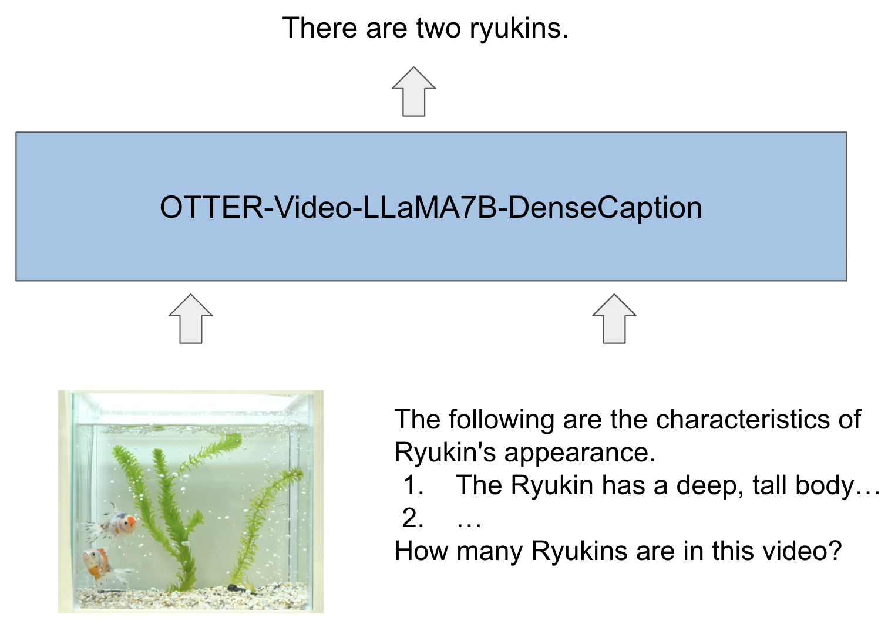

# alcon2023
## インストール&実行
- 仮想環境：`conda env create -f environment.yml`
- 実行：`python main.py --input_csv_path="./input.csv" --output_csv_path="./output.csv"`
  - 実行時には、入力動画のメタデータが書かれたCSVへのパス、出力CSVへのパスを指定してください.
  - 入力CSVのフォーマットは実施要領の仕様に従ってください. 従っていない場合はエラーとなります.
  - 上記のパスの指定がおかしい場合や,メタデータが書かれたCSVの1行目の動画へのパスの指定がおかしい場合にはエラーとなります.
- 動作確認はUbuntu 20.04上で行いました

## 処理の流れ
※詳細は予稿を確認してください
1. 動画のメタデータが書かれたCSVファイルを読み込み,動画MP4ファイルを読み込む
2. 背景差分を用いて動体以外の背景を透過させる
3. 背景を透過させた動画と`./prompt`以下にある文章を,マルチモーダルLLM`luodian/OTTER-9B-DenseCaption`に入力する
4. 出力をフォーマットしてCSVに出力する

